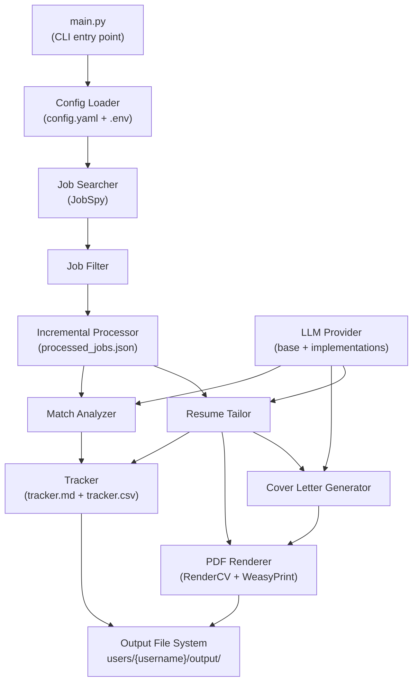

# Design Document: Job Pipeline

## Overview

The Job Pipeline is a local-first, privacy-first CLI tool that automates the preparation of job application materials. Given a user's base resume and job search criteria, it:

1. Searches Indeed and LinkedIn for matching jobs via JobSpy
2. Filters and deduplicates results according to user-configured criteria
3. Uses a configured LLM (local or cloud) to tailor the resume, write a cover letter, and produce a match score for each job
4. Converts markdown output to PDFs using RenderCV (resume) and WeasyPrint (cover letter)
5. Maintains a per-user markdown and CSV tracker
6. Stores all state incrementally so repeated runs skip previously processed jobs

The system is multi-user: every path is scoped under `users/{username}/`. No job application is ever submitted automatically — the pipeline only prepares materials.

### Key Research Findings

- **RenderCV** reads a single YAML file with `cv`, `design`, `locale`, and `rendercv_settings` sections and invokes the Typst compiler to produce an ATS-readable PDF. The CLI entry point is `rendercv render <file.yaml>`. The markdown-to-YAML converter must produce a file conforming to the RenderCV schema.
- **JobSpy** (`python-jobspy`) exposes a `scrape_jobs()` function returning a pandas DataFrame with columns including `title`, `company`, `location`, `min_amount`, `max_amount`, `job_url`, and `description`. Python ≥ 3.10 is required.
- **WeasyPrint** converts HTML+CSS to PDF. The cover-letter pipeline converts markdown → HTML (via `markdown` library) → PDF (via WeasyPrint), keeping the text layer fully extractable.
- **uv** manages the Python environment (`pyproject.toml` + `uv.lock`). All commands run via `uv run`.

---

## Architecture

The pipeline follows a linear, stage-based architecture. Each stage is an independent module under `src/`. `main.py` is the CLI entry point that orchestrates stages.



### Stage Execution Modes

| CLI command | Stages executed |
|---|---|
| `search` | Config load → Job search → Job filter → Save job files |
| `tailor` | Config load → Incremental check → Resume tailor → Cover letter → Match analysis → PDF render → Tracker update |
| `all` | All stages in order: search, then tailor |

---

## Components and Interfaces

### `main.py` — CLI Entry Point

Uses `argparse` to parse commands and flags.

```python
# main.py
def main():
    parser = argparse.ArgumentParser(prog="job_pipeline")
    parser.add_argument("--user", required=True)
    parser.add_argument("--config", default=None)
    parser.add_argument("--force", action="store_true")
    subparsers = parser.add_subparsers(dest="command")
    subparsers.add_parser("search")
    subparsers.add_parser("tailor")
    subparsers.add_parser("all")
```

The CLI resolves all paths, loads config, then delegates to the appropriate pipeline function in `src/pipeline.py`.

---

### `src/config.py` — Configuration Loader

Responsible for loading `config.yaml`, validating required keys, and making config available as a typed dataclass.

```python
@dataclass
class SearchConfig:
    keywords: str
    location: str
    remote: bool
    results_wanted: int
    min_salary: int | None
    exclude_companies: list[str]

@dataclass
class PdfConfig:
    theme: str  # default: "sb2nov"

@dataclass
class AppConfig:
    provider: str
    model: str
    base_url: str | None
    base_resume: str
    output_dir: str
    search: SearchConfig
    pdf: PdfConfig
```

Required top-level keys: `provider`, `model`, `base_resume`, `output_dir`, `search`.
Optional keys: `base_url`, `pdf`.
Raises `ConfigError` with the missing key name on validation failure.
Loads `.env` using `python-dotenv` before reading environment variables.

---

### `src/llm/base.py` — LLM Provider Abstraction

```python
from abc import ABC, abstractmethod

class LLMProvider(ABC):
    @abstractmethod
    def complete(self, prompt: str) -> str:
        """Send prompt and return the model response as a string."""
        ...

def get_provider(config: AppConfig) -> LLMProvider:
    """Factory that returns the correct provider based on config.provider."""
    ...
```

Provider implementations:

| File | Provider key | API style |
|---|---|---|
| `lmstudio_provider.py` | `lmstudio` | OpenAI-compatible (`base_url` required) |
| `ollama_provider.py` | `ollama` | Ollama REST API (`base_url` required) |
| `anthropic_provider.py` | `anthropic` | Anthropic Messages API (key from `ANTHROPIC_API_KEY`) |
| `openai_provider.py` | `openai` | OpenAI Chat Completions API (key from `OPENAI_API_KEY`) |

All raise `LLMError` on network/HTTP failure, including provider name and status code.
`get_provider` raises `ConfigError` for unrecognised provider names.

---

### `src/search_jobs.py` — Job Searcher

Wraps `jobspy.scrape_jobs()` and applies the Job Filter.

```python
def search_jobs(config: AppConfig, user_dir: Path) -> list[Job]:
    """Query JobSpy, filter results, save job files, return accepted Job list."""
    ...

def _filter_jobs(jobs: pd.DataFrame, config: SearchConfig) -> pd.DataFrame:
    """Apply deduplication, description length, salary, and company exclusion filters."""
    ...

def _save_job(job: Job, output_dir: Path) -> None:
    """Write job.md and job.json to output_dir/{job.slug}/."""
    ...
```

---

### `src/tailor_resume.py` — Resume Tailor, Cover Letter Generator, Match Analyzer

Three closely related functions in one module.

```python
def tailor_resume(job: Job, config: AppConfig, user_dir: Path, llm: LLMProvider) -> Path:
    """Produce resume.md for a job. Returns path to written file."""
    ...

def generate_cover_letter(job: Job, config: AppConfig, user_dir: Path, llm: LLMProvider) -> Path:
    """Produce cover_letter.md for a job. Returns path to written file."""
    ...

def analyze_match(job: Job, config: AppConfig, user_dir: Path, llm: LLMProvider) -> MatchResult:
    """Produce match_notes.md and return a MatchResult. Clamps score to [0, 100]."""
    ...
```

---

### `src/render_pdf.py` — PDF Renderer

```python
def render_resume_pdf(job: Job, output_dir: Path, theme: str) -> Path:
    """Convert resume.md → resume.yaml (RenderCV schema) → resume.pdf via CLI."""
    ...

def render_cover_letter_pdf(job: Job, output_dir: Path) -> Path:
    """Convert cover_letter.md → HTML → PDF via WeasyPrint."""
    ...

def _md_to_rendercv_yaml(md_content: str, personal_info: dict) -> dict:
    """Parse structured markdown resume and return a RenderCV-compatible dict."""
    ...
```

---

### `src/tracker.py` — Application Tracker

```python
def update_tracker(job: Job, match: MatchResult, output_dir: Path) -> None:
    """Append or update a row in tracker.md and tracker.csv."""
    ...
```

Reads the existing tracker file (if any), finds a row by `(company, title)` key, updates in place or appends a new row. Writes both `.md` and `.csv` atomically (write to temp file, rename).

---

### `src/utils.py` — Shared Utilities

```python
def make_job_slug(company: str, title: str) -> str:
    """Lowercase, hyphenate, truncate to 80 chars."""
    ...

def load_prompt(template_name: str, user_dir: Path, variables: dict[str, str]) -> str:
    """Load from user_dir/prompts/ with fallback to global prompts/. Substitute variables."""
    ...

def scaffold_user_dir(user_dir: Path) -> None:
    """Create resumes/, output/, prompts/, config.yaml stub, processed_jobs.json."""
    ...
```

---

## Data Models

### `Job`

```python
@dataclass
class Job:
    id: str                  # stable hash: sha256(company + title + source_url)[:16]
    title: str
    company: str
    location: str
    salary_min: int | None
    salary_max: int | None
    source_url: str
    description: str
    slug: str                # derived via make_job_slug()
```

### `MatchResult`

```python
@dataclass
class MatchResult:
    score: int               # clamped to [0, 100]
    strong_matches: list[str]
    gaps: list[str]
    suggestions: list[str]
    raw_text: str            # full LLM response written to match_notes.md
```

### `metadata.json` schema

```json
{
  "job_slug": "acme-corp-backend-engineer",
  "processed_at": "2025-01-15T14:32:00Z",
  "provider": "lmstudio",
  "model": "qwen3-8b",
  "match_score": 84
}
```

### `processed_jobs.json` schema

```json
["abc123def456", "feed87654321", "..."]
```

A flat JSON array of job ID strings. Appended to (never rewritten in full) to minimise file corruption risk.

### `config.yaml` structure

```yaml
provider: lmstudio          # lmstudio | ollama | anthropic | openai
model: qwen3-8b
base_url: http://localhost:1234/v1   # required for lmstudio/ollama
base_resume: resumes/backend.md
output_dir: output/

pdf:
  theme: sb2nov             # classic | moderncv | sb2nov | engineeringresumes | engineeringclassic

search:
  keywords: "backend engineer python"
  location: "Remote"
  remote: true
  results_wanted: 20
  min_salary: 100000        # optional
  exclude_companies:        # optional
    - "Acme Corp"
```

### RenderCV YAML structure (generated by `_md_to_rendercv_yaml`)

```yaml
cv:
  name: "Jane Doe"
  email: "jane@example.com"
  sections:
    experience:
      - company: "Acme Corp"
        position: "Software Engineer"
        start_date: "2020-01"
        end_date: "present"
        highlights:
          - "Built REST API serving 1M req/day"
    education:
      - institution: "University of Example"
        area: "Computer Science"
        degree: "BS"
        start_date: "2016-09"
        end_date: "2020-05"
    skills:
      - label: "Languages"
        details: "Python, Go, SQL"

design:
  theme: sb2nov
```

### Prompt variable substitution contract

Templates use `{{base_resume}}` and `{{job_description}}` as placeholders. The loader performs a simple `str.replace()` substitution. No external templating library is required.

---

## Correctness Properties

*A property is a characteristic or behavior that should hold true across all valid executions of a system — essentially, a formal statement about what the system should do. Properties serve as the bridge between human-readable specifications and machine-verifiable correctness guarantees.*

### Property 1: Job slug is deterministic and filesystem-safe

*For any* company name and job title (including names containing spaces, special characters, unicode, or extreme lengths), `make_job_slug()` SHALL produce a string that contains only lowercase letters, digits, and hyphens, and whose length does not exceed 80 characters.

**Validates: Requirements 10.2**

### Property 2: Slug is stable across equivalent inputs

*For any* company name and job title, calling `make_job_slug()` twice with the same inputs SHALL return the identical string.

**Validates: Requirements 10.2**

### Property 3: Duplicate job filter removes exact duplicates

*For any* list of jobs that contains two or more entries sharing the same (company, title) pair, applying the Job_Filter SHALL produce a list where each (company, title) pair appears at most once.

**Validates: Requirements 1.2**

### Property 4: Short-description filter removes all sub-threshold jobs

*For any* list of jobs that includes entries whose description length is fewer than 100 characters, applying the Job_Filter SHALL produce a list containing no job whose description length is fewer than 100 characters.

**Validates: Requirements 1.3**

### Property 5: Salary filter excludes all below-threshold jobs

*For any* minimum salary threshold `T` and any list of jobs, applying the salary filter SHALL produce a list where no job has a `salary_max` strictly less than `T`.

**Validates: Requirements 1.4**

### Property 6: Match score is always within bounds

*For any* LLM response string returned by the Match_Analyzer, the score written to `match_notes.md` and stored in `MatchResult.score` SHALL be an integer in the closed range [0, 100].

**Validates: Requirements 6.3, 6.5**

### Property 7: Incremental processor never reprocesses a seen job

*For any* set of processed job IDs `S` and any job whose ID is a member of `S`, the Incremental_Processor SHALL mark that job as skipped without invoking the LLM or writing output files.

**Validates: Requirements 2.2, 2.3**

### Property 8: Prompt variable substitution is complete

*For any* prompt template containing `{{base_resume}}` and `{{job_description}}` placeholders, and any non-empty resume and job description strings, the result of `load_prompt()` SHALL contain neither `{{base_resume}}` nor `{{job_description}}` as literal substrings.

**Validates: Requirements 11.2**

### Property 9: LLM response length guard prevents empty file writes

*For any* LLM response string of length fewer than 50 characters, the Resume_Tailor and Cover_Letter_Generator SHALL raise an error and SHALL NOT write any file to the output directory.

**Validates: Requirements 4.5, 5.5**

### Property 10: Tracker upsert preserves uniqueness by (company, title)

*For any* tracker file and any job identified by `(company, title)`, calling `update_tracker()` any number of times SHALL result in exactly one row for that `(company, title)` pair in both `tracker.md` and `tracker.csv`. Each row SHALL contain all required columns (Company, Title, Location, Match Score, Salary, Link, Resume, Status) and new entries SHALL have Status set to `- [ ]`.

**Validates: Requirements 8.1, 8.2, 8.3, 8.4, 8.5**

### Property 11: Accepted job files are always written as a pair

*For any* accepted job (one that passes all filters), after the search stage completes, both `job.md` and `job.json` SHALL exist inside `output/{slug}/` and `job.json` SHALL contain non-empty values for title, company, location, and source_url fields.

**Validates: Requirements 1.6, 1.7**

### Property 12: Resume markdown to RenderCV YAML preserves required structure

*For any* structured resume markdown string that contains name, experience, and education sections, `_md_to_rendercv_yaml()` SHALL produce a dict that contains the top-level keys `cv` and `design`, where `cv` has a `sections` key with at least one section entry.

**Validates: Requirements 7.3**

### Property 13: Metadata JSON contains all required fields after processing

*For any* job and run context (provider, model, match score), the `metadata.json` written after processing SHALL contain exactly the keys: `job_slug`, `processed_at`, `provider`, `model`, and `match_score`, with `processed_at` being a valid ISO 8601 timestamp.

**Validates: Requirements 10.4**

---

## Error Handling

### Error taxonomy

| Error class | When raised | Recovery |
|---|---|---|
| `ConfigError` | Missing/invalid config key, unknown provider, missing `.env` | Exit with descriptive message, name the missing key |
| `UserError` | `--user` flag omitted, `config.yaml` missing | Exit with descriptive message, show expected path |
| `LLMError` | Network failure, HTTP error from provider | Log with provider + status code, continue to next job |
| `RenderError` | Missing source file, RenderCV non-zero exit, output PDF not found | Log with job slug and file path, continue to next job |
| `PromptError` | Missing prompt template file | Log with filename, abort current job, continue to next job |
| `ValidationError` | LLM returns < 50 char response | Log, skip file write, continue to next job |

### Per-job error isolation

Requirement 13.8 mandates that a single job failure does not abort the entire pipeline. The outer loop in `src/pipeline.py` wraps each job's processing in a `try/except` block:

```python
for job in unprocessed_jobs:
    try:
        process_job(job, config, user_dir, llm)
    except Exception as exc:
        logger.error("user=%s slug=%s error=%s", username, job.slug, exc)
        continue
```

Startup errors (`ConfigError`, `UserError`) are fatal and cause an immediate exit before any job processing begins.

---

## Testing Strategy

### Dual testing approach

- **Unit tests** (pytest): verify concrete examples, edge cases, and error conditions
- **Property-based tests** (Hypothesis): verify universal properties across all inputs

Both are required; they are complementary.

### Property-based testing

Library: **Hypothesis** (`hypothesis` package)

Each correctness property maps to exactly one property-based test. Tests use `@given` strategies to generate diverse inputs. Each test runs a minimum of **100 examples** (Hypothesis default).

Test tag comment format:
```python
# Feature: job-pipeline, Property N: <property text>
```

**Property → test mapping:**

| Property | Strategy |
|---|---|
| P1: Slug filesystem-safety | `st.text()` for company and title, assert charset and length |
| P2: Slug stability | `st.text()` pairs, call twice, assert equal |
| P3: Duplicate filter | `st.lists(job_strategy())`, inject duplicate (company, title) pairs |
| P4: Short-description filter | `st.lists(job_strategy())`, inject descriptions with `len < 100` |
| P5: Salary filter | `st.integers()` for threshold, `st.lists(job_strategy())` |
| P6: Match score bounds | `st.text()` for raw LLM response, verify clamped score in [0, 100] |
| P7: Incremental processor | `st.sets(st.text())` for IDs, verify job with known ID is skipped |
| P8: Prompt substitution | `st.text()` for resume and description content, assert no placeholder remains |
| P9: LLM length guard | `st.text(max_size=49)` as LLM response, assert error raised and no file written |
| P10: Tracker upsert uniqueness | `st.lists(job_strategy())`, multiple update_tracker() calls, verify one row |
| P11: Job file pair written | `st.lists(job_strategy(), min_size=1)`, verify both files exist after search |
| P12: Resume YAML structure | `st.text()` as resume markdown, verify required YAML keys present |
| P13: Metadata JSON fields | `job_strategy()` + run context, verify all required fields and ISO timestamp |

### Unit tests

Focus areas:
- `ConfigError` is raised with the correct key name for each missing required field
- `get_provider()` raises `ConfigError` for an unknown provider string
- `make_job_slug()` produces expected output for known inputs (spaces → hyphens, 80-char truncation)
- `_md_to_rendercv_yaml()` produces a dict with the expected top-level keys for a sample resume
- `load_prompt()` loads user-level override when present, falls back to global otherwise
- Tracker reads and re-writes existing entries correctly
- `processed_jobs.json` is created with an empty list when missing

### Integration tests

- Full `search` command with a mocked `scrape_jobs()` — verify job files written to correct paths
- Full `tailor` command with a stub LLM — verify all expected output files written
- `--force` flag causes already-processed jobs to be reprocessed

### Test file layout

```
tests/
├── unit/
│   ├── test_config.py
│   ├── test_utils.py
│   ├── test_filter.py
│   ├── test_tailor.py
│   ├── test_match.py
│   ├── test_tracker.py
│   └── test_render.py
├── property/
│   ├── test_slug_properties.py        # P1, P2
│   ├── test_filter_properties.py      # P3, P4, P5
│   ├── test_match_properties.py       # P6
│   ├── test_incremental_properties.py # P7
│   ├── test_prompt_properties.py      # P8
│   ├── test_llm_guard_properties.py   # P9
│   ├── test_tracker_properties.py     # P10
│   ├── test_search_output_properties.py  # P11
│   ├── test_render_properties.py      # P12
│   └── test_metadata_properties.py    # P13
└── integration/
    ├── test_search_pipeline.py
    └── test_tailor_pipeline.py
```
